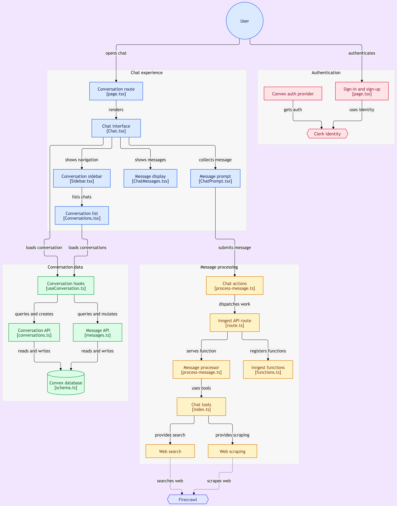

# NitiAssist

NitiAssist is an authenticated AI assistant for discovering and understanding government financial policies, subsidies, schemes, tax benefits, and other forms of financial assistance.

The application combines a conversational chat interface with a multi-agent workflow. It can answer general questions directly, or route policy-related questions to a web-research agent that searches and scrapes current information before producing a final response.

## What it does

- Provides a focused chat experience for financial-policy questions.
- Uses Clerk for sign-in, sign-up, and request protection.
- Stores conversations and messages in Convex.
- Maintains recent conversation context for follow-up questions.
- Uses Inngest to run message processing asynchronously.
- Uses Inngest Agent Kit to coordinate specialist agents.
- Uses OpenAI (`gpt-4o-mini`) for agent responses.
- Uses Firecrawl for web search and page extraction.
- Supports cancellation while an assistant response is being generated.
- Renders assistant responses as Markdown, including code, math, Mermaid, and other rich content supported by the UI components.
- Includes a responsive sidebar for starting chats and opening recent conversations.
- Includes light/dark theme support through `next-themes`.

## Architecture

The diagram below shows how the user interface, authentication, Convex data layer, Inngest processing pipeline, agent network, and Firecrawl tools fit together.

<p align="center">
  <a href="./public/diagram.png" target="_blank" rel="noreferrer">
    
  </a>
</p>

<p align="center"><em>Click the diagram to open the original high-resolution image, then use your browser's zoom controls to inspect individual nodes and connections.</em></p>

### Request lifecycle

1. An authenticated user opens the conversation route and enters a prompt.
2. The chat UI creates a conversation when needed, then writes the user message and a placeholder assistant message to Convex.
3. The server action sends a `chat/message.created` event to Inngest.
4. The Inngest function builds the prompt with recent conversation history and runs the Financial Policy Assistant network.
5. The network begins with the Conversation Agent. It can answer directly or route the request to the Financial Policy Web Agent.
6. The web agent uses `web_search` and `web_scrape` tools backed by Firecrawl when current policy information is required.
7. The Final Answer Agent synthesizes the available context when the workflow reaches its final response step.
8. The generated answer and its final status are written back to the assistant message in Convex.
9. Convex queries update the UI reactively, showing the completed response in the open conversation.

Cancellation sends `chat/message.cancelled`. Inngest cancels the matching running function, and the cancellation handler marks the assistant message as `cancelled` with a user-visible message.

## Technology stack

| Area | Technology |
| --- | --- |
| Web framework | Next.js `16.3.4` with the App Router |
| Language | TypeScript |
| UI | React `19`, Tailwind CSS `4`, shadcn/ui-style components |
| Authentication | Clerk |
| Database and reactive queries | Convex |
| Background processing | Inngest |
| Agent orchestration | `@inngest/agent-kit` |
| Language model | OpenAI `gpt-4o-mini` |
| Web research | Firecrawl |
| Icons and interaction | Lucide React, Radix/Base UI primitives, Motion |
| Formatting and rendering | Streamdown, Shiki, Mermaid, math and code renderers |

## Project structure

```text
.
├── app/
│   ├── (app)/
│   │   ├── page.tsx                 # New conversation screen
│   │   ├── [id]/page.tsx            # Conversation screen for an existing chat
│   │   └── layout.tsx               # Sidebar and authenticated app shell
│   ├── (auth)/
│   │   ├── sign-in/                 # Clerk sign-in page
│   │   └── sign-up/                 # Clerk sign-up page
│   ├── api/inngest/route.ts         # Inngest event/function endpoint
│   ├── globals.css                  # Global styles and theme tokens
│   └── layout.tsx                   # Clerk, Convex, theme, fonts, and toaster
├── components/
│   ├── ai-elements/                 # Chat and rich assistant-response UI
│   ├── ui/                          # Reusable UI primitives
│   ├── ConvexClientProvider.tsx     # Convex + Clerk client integration
│   └── theme-provider.tsx           # Theme provider
├── convex/
│   ├── schema.ts                    # Conversations and messages schema
│   ├── conversations.ts             # Conversation queries and mutations
│   ├── messages.ts                  # Message queries and mutations
│   ├── auth.config.ts               # Clerk provider configuration
│   └── verifyAuth.ts                # Server-side Convex identity guard
├── features/
│   ├── chat/
│   │   ├── components/             # Chat, prompt, and message display
│   │   ├── actions/                # Server actions that emit Inngest events
│   │   └── inngest/                # Agent network, prompts, and tools
│   └── side-layout/                # Sidebar and conversation list
├── hooks/useConversation.ts        # Convex hooks used by the chat UI
├── inngest/
│   ├── client.ts                   # Inngest client (`NitiAssist`)
│   └── functions.ts                # Inngest function registration
├── lib/utils.ts                    # Shared utilities
├── public/diagram.png              # Full project architecture diagram
├── proxy.ts                        # Clerk route protection
└── package.json                    # Scripts and dependencies
```

## Data model

Convex currently defines two tables:

### `conversations`

- `title`: short title shown in the sidebar.
- `ownerId`: Clerk subject identifier for the owner.
- `updateAt`: timestamp used to order recent conversations.
- Index: `by_owner` on `ownerId`.

### `messages`

- `conversationId`: parent conversation reference.
- `role`: either `user` or `assistant`.
- `content`: message text.
- `status`: `processing`, `completed`, or `cancelled` for assistant lifecycle tracking.
- Index: `by_conversation` on `conversationId`.

All Convex queries and mutations verify the authenticated identity. Conversation message reads additionally confirm that the requesting identity owns the conversation.

## Agent workflow

The agent network is defined in `features/chat/inngest/process-message.ts`:

- **Conversation Agent** handles greetings, general questions, explanations, and requests that do not need live research.
- **Financial Policy Web Agent** researches schemes, subsidies, eligibility, documents, amounts, deadlines, and application procedures using Firecrawl.
- **Final Answer Agent** produces the final response from the conversation and gathered research without calling additional tools.

The network starts with the Conversation Agent and has a maximum of five iterations. The web agent can continue searching or scraping, while the final agent is selected at the workflow limit so the system returns a response instead of starting another tool loop.

### Web tools

`firecrawl-search.ts` exposes `web_search`, which returns titles, URLs, and descriptions. `firecrawl-scrape.ts` exposes `web_scrape`, which validates HTTP(S) URLs and extracts the main page content as Markdown.

The web-agent instructions prefer official government and other primary sources. Users should still verify important eligibility, deadline, and financial information with the relevant official authority before acting on it.

## Prerequisites

- Node.js compatible with the installed Next.js and TypeScript versions.
- npm.
- A Clerk application.
- A Convex deployment connected to the project.
- An Inngest account, or the local Inngest Dev Server for development.
- An OpenAI API key.
- A Firecrawl API key for live web research.

## Getting started

### 1. Install dependencies

```bash
npm install
```

### 2. Configure environment variables

Create `.env.local` in the project root. Use your own values; never commit secrets.

```env
# Convex
CONVEX_DEPLOYMENT=your-convex-deployment
NEXT_PUBLIC_CONVEX_URL=https://your-deployment.convex.cloud
NEXT_PUBLIC_CONVEX_SITE_URL=https://your-deployment.convex.site

# Clerk
NEXT_PUBLIC_CLERK_PUBLISHABLE_KEY=pk_...
CLERK_SECRET_KEY=sk_...
CLERK_FRONTEND_API_URL=https://your-clerk-issuer-domain
NEXT_PUBLIC_CLERK_SIGN_IN_URL=/sign-in
NEXT_PUBLIC_CLERK_SIGN_UP_URL=/sign-up

# Agent processing and web research
OPENAI_API_KEY=sk-...
FIRECRAWL_API_KEY=fc-...

# Optional local Inngest setting
INNGEST_DEV=1
```

`CLERK_FRONTEND_API_URL` must match the issuer/frontend API URL configured for the Convex Clerk provider. In Convex, configure the same Clerk issuer domain in the deployment's authentication settings.

### 3. Start Convex

Run the Convex development workflow in a separate terminal and follow its prompts to connect the local project to your Convex deployment:

```bash
npx convex dev
```

The Convex generated files under `convex/_generated/` are used by the application. Keep them in sync with the schema and functions in `convex/`.

### 4. Start Inngest locally

Run the local Inngest Dev Server in another terminal if you are developing without a hosted Inngest environment:

```bash
npx inngest-cli dev
```

The Inngest endpoint is exposed by the Next.js route at `/api/inngest`.

### 5. Start the application

```bash
npm run dev
```

Open [http://localhost:3000](http://localhost:3000), create an account, and start a conversation.

## Available scripts

| Command | Purpose |
| --- | --- |
| `npm run dev` | Start the Next.js development server |
| `npm run build` | Create a production build |
| `npm run start` | Start the production server after building |
| `npm run lint` | Run ESLint |
| `npm run typecheck` | Run TypeScript without emitting files |
| `npm run format` | Format TypeScript and TSX files with Prettier |

Before opening a pull request, run:

```bash
npm run lint
npm run typecheck
npm run build
```

## Authentication and route protection

Clerk wraps the application in `app/layout.tsx`. `proxy.ts` protects every route except:

- `/sign-in(.*)`
- `/sign-up(.*)`
- `/api/inngest(.*)`

Static assets and Next.js internals are excluded from the Clerk matcher. Convex server functions independently call `verifyAuth`, so database access remains protected even when functions are invoked outside the main UI.

## Deployment checklist

1. Create production Clerk and Convex configurations.
2. Set the production Clerk issuer in Convex authentication settings.
3. Apply the Convex schema and deploy the Convex functions.
4. Configure production environment variables in the hosting provider.
5. Register the deployed `/api/inngest` endpoint with Inngest.
6. Confirm that `OPENAI_API_KEY` and `FIRECRAWL_API_KEY` are available to the Inngest runtime.
7. Build and validate the application with `npm run build`.
8. Test sign-in, conversation creation, message processing, cancellation, and a web-research question in the deployed environment.

## Troubleshooting

### The assistant message stays in `processing`

Check that the Inngest Dev Server or hosted Inngest endpoint can reach `/api/inngest`, and confirm that `OPENAI_API_KEY` is available to the process executing the Inngest function.

### Web research fails

Confirm that `FIRECRAWL_API_KEY` is set and that the requested URL uses `http://` or `https://`. Firecrawl failures are surfaced by the tool and the assistant workflow marks the response as cancelled when processing cannot complete.

### Convex reports an authentication error

Check `NEXT_PUBLIC_CONVEX_URL`, `CLERK_FRONTEND_API_URL`, and the Clerk issuer configuration in Convex. Also confirm that the browser is signed in with the same Clerk application configured for the deployment.

### The generated Convex API types are stale

Keep `npx convex dev` running while changing Convex functions or schema so the files in `convex/_generated/` are regenerated.

## Security notes

- Keep Clerk, OpenAI, Firecrawl, and Convex secrets out of source control.
- Only expose values prefixed with `NEXT_PUBLIC_` when they are safe for the browser.
- Treat generated answers as assistance, not as a replacement for official policy or financial advice.
- Verify current scheme rules, eligibility, deadlines, documents, and amounts with the relevant government authority.
- Review tool permissions and source quality before expanding the agent network to additional external services.

